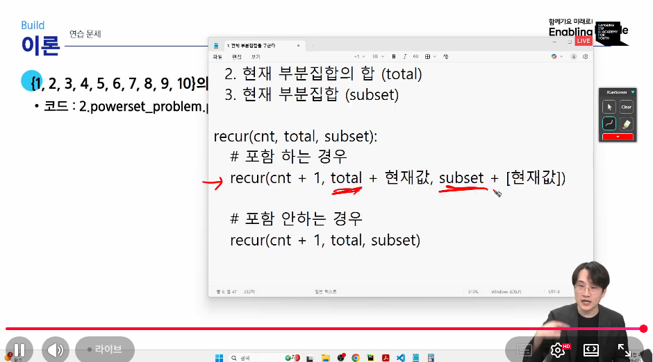
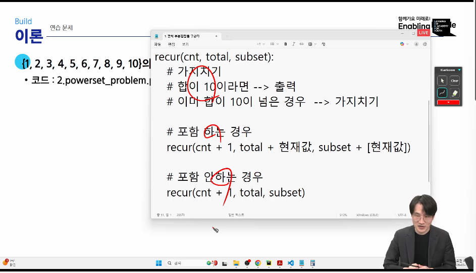
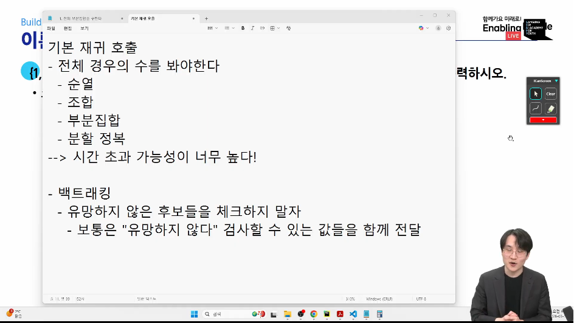
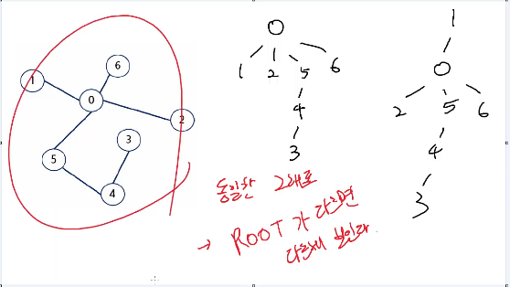
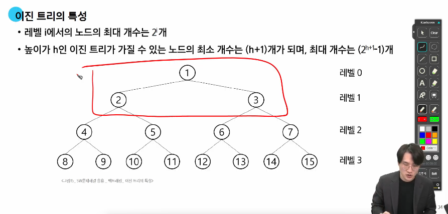
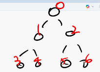
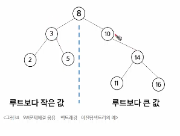
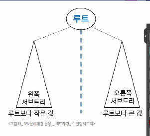
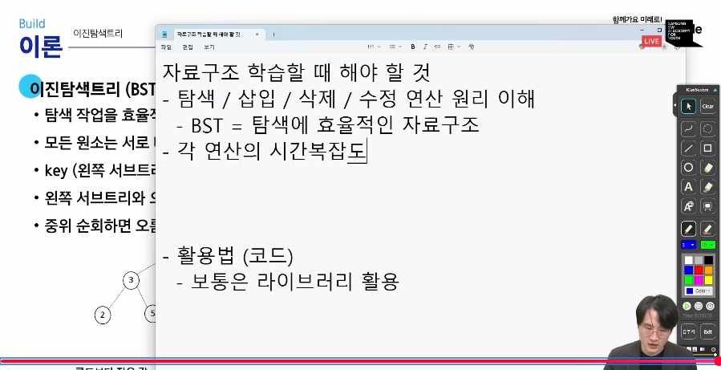

# 목차
- 백트래킹
- 트리
## 백트래킹
- 부분집합의 합 10인 것만 출력 연습문제
  
  

## 트리
- 싸이클이 없는 그래프
  - 싸이클: 한 노드에서 출발해서 해당 노드로 돌아올 수 있다.
- 싸이클이 없다면 어떤 특징들이 생길까?
  - 계층 구조로 생각할 수 있다.
  - 자식이 2개이하인게 많이쓰인다(이진트리)
- 트리란 싸이클이 없는 무향 연결 그래프임.

- 루트가 다르면 다르게 보인다.

### 이진트리의 특성

- N개의 노드 => 이진트리 높이의 범위 구할때 자주 쓰인다.
  - 가장높을떄: N과 같다.
  - 가장낮을때: logN
### 순회
- 트리의 각 노드를 중복되지 않게 전부 방문하는 것 
- 전위,중위,후위순회
### 이진트리 순회
- depth: 트리의 높이
- branch:왼쪽자식, 오른쪽자식
  
------------이진트리를 저장하는 코드
1. 일차원 리스트
   - 부모노드번호를 기준으로 자식노드번호를 찾아가자
     - 부모노드번호가 1번부터 시작
     - 왼쪽자식:부모인덱스 * 2
     - 오른쪽자식: 부모인덱스 * 2 + 1
   - 부모노드번호가 0번부터 시작
 
     - 왼쪽자식: 부모인덱스*2 +1
     - 오른쪽자식: 부모인덱스*2 +2
2. 연결리스트
   - 개발에서 쓰이는 방식 (코테에서는 조금 어렵다)
   - class로 왼쪽 오른쪽을 정의
3. 그래프로 표현
   - 인접행렬
     - 연결안된 정보까지 같이 저장하자
   - 인접리스트
     - 연결 정보만 저장하자
  >연습문제 풀어보기

### 이진탐색트리
- 어느정도 정렬된 구조로 저장하고 싶다.
  - 작으면 왼쪽 / 크면 오른쪽  

- 왜쓰는가?
  - 탐색작업을 효율적으로 하기 위해
  

## 삭제
1. 리프노드: 그냥삭제
2. 자식이1개: 자식과 부모를 연결
3. 자식이2개: 후보: 왼쪽 서브트리 중 가장 큰 값 또는 오른쪽 서브트리 중 가장 작은값

## 힙
굉장히 중요하다.
- 우선순위 큐
  - 우선순위가 가장 높은 데이터가 먼저 나온다.
- 완전 이진 트리에 있는 노드 중에서 키 값이 가장 큰 노드나 키 값이 가장 작은 노드를 찾기 위해서 만든 구조.
- 최대힙: 부모가 무조건 더크다.
- 최소힙: 부모가 무조건 더작다.
- ROOT데이터만 본다!
### 힙연산- 삽입
- 일단 넣고 바꾸고 바꾸기.
### 힙연산- 삭제
- 자식노드중 큰값이랑 swap

### 코드
heap.heapify(arr) : 최소힙으로바꿔줌
heapq.heappush(max_heap, num)
최대힙은 -num으로 하고 다시 음수를곱해준다.

