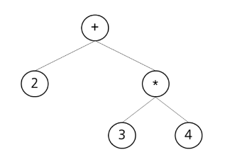
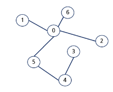
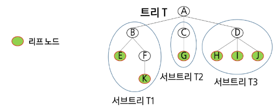

# 학습 목표
- 백트래킹 개념을 학습하고 최적화 문제와 결정 문제에 적용할 수 있음을 이해한다.
- 백트래킹으로 상태공간트리를 탐색하는 방법에 대해 이해한다.
- 이진 트리의 순회에 대해 설명할 수 있다.
- 이진탐색트리의 연산에 대해 설명할 수 있다.
- 힙 트리에 대해 설명할 수 있다.
# 목차
- 백트래킹
  - 백트래킹 응용
  - 연습 문제
- 트리
  - 트리 개요
  - 이진 트리
  - 연습 문제
  - 이진탐색트리
  - 힙
# 백트래킹
- 문제제시: n*n 장기판에서 배치한 Queen들이 서로 위협하지 않도록 n개의 Queen을 배치하는 문제
  - 어떤 두 Queen도 서로를 위협하지 않아야 한다.
  - Queen을 배치한 n개의 위치는?
- 백트래킹 개념
  - 여러 가지 선택지들이 존재하는 상황에서 한 가지를 선택함.
  - 선택이 이루어지면 새로운 선택지들의 집합이 생성됨.
  - 이런 선택을 반복하면서 최종 상태에 도달함
    - 올바른 선택을 계속하면 목표 상태(goal state)에 도달합니다.
- 백트래킹과 깊이 우선 탐색과의 차이
  - 어떤 노드에서 출발하는 경로가 해결책으로 이어질 것 같지 않으면 더 이상 그 경로를 따라가지 않음으로써 시도의 횟수를 줄임
  - 이를 Pruning(가지치기)라고 한다.
  - 깊이 우선 탐색이 모든 경로를 추적하는데 비해 백트래킹은 불필요한 경로를 조기에 차단
  - 깊이 우선 탐색을 가하기에는 경우의 수가 너무나 많은 경우, 즉 N! 가지의 경우의 수를 가진 문제에 대해 깊이 우선 탐색을 가하면 당연히 처리 불가능한 문제가 됨.
  - 백트래킹 알고리즘을 적용하면 일반적으로 경우의 수가 줄어들지만, 이 역시 최악의 경우에는 여전히 지수함수시간을 요하므로 처리 불가능함.
- 8-Queens 문제
  - 퀸 8개를 8*8 크기의 체스판 안에 서로를 공격할 수 없도록 배치하는 모든 경우를 구하는 문제
  - 후보 해의 수: 64C8 = 4,426,165,368
  - 실제 해의 수: 이 중에서 실제 해는 92개뿐
  - 즉, 44억개가 넘는 후보 해의 수 속에서 92개를 최대한 효율적으로 찾아내는 것이 관건
- 4-Quuens 문제로 축소해서 생각해보기
  - 같은 행에 위치할 수 없음
  - 모든 경우의 수: 4X4X4X4 = 256
- 백트래킹 개념
  - 루트 노드에서 리프노드까지의 경로는 해답후보가 되는데, 깊이 우선 탐색을 하여 그 해답후보 중에서 해답을 찾을 수 있음
  - 그러나 이 방법을 사용하면 해답이 될 가능성이 전혀 없는 노드의 후손 노드들도 모두 검색해야 하므로 비효율적
  - 그렇다면 모든 후보를 검사하는가? No!
- 백트래킹 기법
  - 어떤 노드의 유망성을 점검한 후에 유망하지 않다고 결정되면 그 노드의 부모로 되돌아가 다음 자식 노드로 감
  - 어떤 노드를 방문하였을 때 그 노드를 포함한 경로가 해답이 될 수 없다면 그 노드는 유망하지 않다고 하며, 반대로 해답의 가능성이 있으면 유망하다고 함
  - 가지치기(pruning): 유망하지 않은 노드가 포함되는 경로는 더 이상 고려하지 않음
- 백트래킹을 이용한 알고리즘의 절차
  - 1. 상태공간 트리의 깊이 우선 탐색을 실시한다.
  - 2. 각 노드가 유망한지를 점검한다.
  - 3. 만일 그 노드가 유망하지 않으면, 그 노드의 부모 노드로 돌아가서 검색을 계속한다.

# 트리
## 트리 개요
- 문제 제시: 계산기
  - 수식 2 + 3* 4 를 다음과 같은 그래프로 표현하고 그래프를 순회하여 수식을 계산하는 문제
  - 
- 트리(Tree)
  - 
  - 트리는 싸이클이 없는 무향 연결 그래프임
    - 두 노드(or 정점) 사이에는 유일한 경로가 존재함.
    - 각 노드는 최대 하나의 부모 노드가 존재할 수 있다.
    - 각 노드는 자식 노드가 없거나 하나 이상이 존재할 수 있다.
  - 비선형 구조
    - 원소들 간에 1:n 관계를 가지는 자료구조 이다.
    - 원소들 간에 계층관계를 가지는 계층형 자료구조 이다.
  - 트리의 정의
    - 한 개 이상의 노드로 이루어진 유한 집합이며 다음 조건을 만족함
      - 노드 중 최상위 노드를 루트(root)라고 한다.
      - 나머지 노드들은 n(>=0)개의 분리 집합 T1,...,TN 으로 분리될 수 있다.
    - 이들 T1,...,TN은 각각 하나의 트리가 되며(재귀적 정의) 루트의 부 트리(subtree)라 함
    - 