# 학습 목표
- 백트래킹 개념을 학습하고 최적화 문제와 결정 문제에 적용할 수 있음을 이해한다.
- 백트래킹으로 상태공간트리를 탐색하는 방법에 대해 이해한다.
- 이진 트리의 순회에 대해 설명할 수 있다.
- 이진탐색트리의 연산에 대해 설명할 수 있다.
- 힙 트리에 대해 설명할 수 있다.
# 목차
- 백트래킹
  - 백트래킹 응용
  - 연습 문제
- 트리
  - 트리 개요
  - 이진 트리
  - 연습 문제
  - 이진탐색트리
  - 힙
# 백트래킹
- 문제제시: n*n 장기판에서 배치한 Queen들이 서로 위협하지 않도록 n개의 Queen을 배치하는 문제
  - 어떤 두 Queen도 서로를 위협하지 않아야 한다.
  - Queen을 배치한 n개의 위치는?
- 백트래킹 개념
  - 여러 가지 선택지들이 존재하는 상황에서 한 가지를 선택함.
  - 선택이 이루어지면 새로운 선택지들의 집합이 생성됨.
  - 이런 선택을 반복하면서 최종 상태에 도달함
    - 올바른 선택을 계속하면 목표 상태(goal state)에 도달합니다.
- 백트래킹과 깊이 우선 탐색과의 차이
  - 어떤 노드에서 출발하는 경로가 해결책으로 이어질 것 같지 않으면 더 이상 그 경로를 따라가지 않음으로써 시도의 횟수를 줄임
  - 이를 Pruning(가지치기)라고 한다.
  - 깊이 우선 탐색이 모든 경로를 추적하는데 비해 백트래킹은 불필요한 경로를 조기에 차단
  - 깊이 우선 탐색을 가하기에는 경우의 수가 너무나 많은 경우, 즉 N! 가지의 경우의 수를 가진 문제에 대해 깊이 우선 탐색을 가하면 당연히 처리 불가능한 문제가 됨.
  - 백트래킹 알고리즘을 적용하면 일반적으로 경우의 수가 줄어들지만, 이 역시 최악의 경우에는 여전히 지수함수시간을 요하므로 처리 불가능함.
- 8-Queens 문제
  - 퀸 8개를 8*8 크기의 체스판 안에 서로를 공격할 수 없도록 배치하는 모든 경우를 구하는 문제
  - 후보 해의 수: 64C8 = 4,426,165,368
  - 실제 해의 수: 이 중에서 실제 해는 92개뿐
  - 즉, 44억개가 넘는 후보 해의 수 속에서 92개를 최대한 효율적으로 찾아내는 것이 관건
- 4-Quuens 문제로 축소해서 생각해보기
  - 같은 행에 위치할 수 없음
  - 모든 경우의 수: 4X4X4X4 = 256
- 백트래킹 개념
  - 루트 노드에서 리프노드까지의 경로는 해답후보가 되는데, 깊이 우선 탐색을 하여 그 해답후보 중에서 해답을 찾을 수 있음
  - 그러나 이 방법을 사용하면 해답이 될 가능성이 전혀 없는 노드의 후손 노드들도 모두 검색해야 하므로 비효율적
  - 그렇다면 모든 후보를 검사하는가? No!
- 백트래킹 기법
  - 어떤 노드의 유망성을 점검한 후에 유망하지 않다고 결정되면 그 노드의 부모로 되돌아가 다음 자식 노드로 감
  - 어떤 노드를 방문하였을 때 그 노드를 포함한 경로가 해답이 될 수 없다면 그 노드는 유망하지 않다고 하며, 반대로 해답의 가능성이 있으면 유망하다고 함
  - 가지치기(pruning): 유망하지 않은 노드가 포함되는 경로는 더 이상 고려하지 않음
- 백트래킹을 이용한 알고리즘의 절차
  - 1. 상태공간 트리의 깊이 우선 탐색을 실시한다.
  - 2. 각 노드가 유망한지를 점검한다.
  - 3. 만일 그 노드가 유망하지 않으면, 그 노드의 부모 노드로 돌아가서 검색을 계속한다.

# 트리
## 트리 개요
- 문제 제시: 계산기
  - 수식 2 + 3* 4 를 다음과 같은 그래프로 표현하고 그래프를 순회하여 수식을 계산하는 문제
  - 
- 트리(Tree)
  - 
  - 트리는 싸이클이 없는 무향 연결 그래프임
    - 두 노드(or 정점) 사이에는 유일한 경로가 존재함.
    - 각 노드는 최대 하나의 부모 노드가 존재할 수 있다.
    - 각 노드는 자식 노드가 없거나 하나 이상이 존재할 수 있다.
  - 비선형 구조
    - 원소들 간에 1:n 관계를 가지는 자료구조 이다.
    - 원소들 간에 계층관계를 가지는 계층형 자료구조 이다.
  - 트리의 정의
    - 한 개 이상의 노드로 이루어진 유한 집합이며 다음 조건을 만족함
      - 노드 중 최상위 노드를 루트(root)라고 한다.
      - 나머지 노드들은 n(>=0)개의 분리 집합 T1,...,TN 으로 분리될 수 있다.
    - 이들 T1,...,TN은 각각 하나의 트리가 되며(재귀적 정의) 루트의 부 트리(subtree)라 함
    - 
  - 트리 용어
    - 노드(node): 트리의 원소이고 정점(vertex)이라고도 함
      - 트리 T의 노드 - A,B,C,D,E,F,G,H,I,J,K
    - 간선(edge): 노드를 연결하는 선.
      - 부모 노드와 자식 노드를 연결한다
    - 루트 노드(root node): 트리의 시작 노드
      - 트리 T의 루트 노드는 A 이다.
    - 리프 노드(leaf node): 자식 노드가 없는 노드
      - E,K,G,H,I,J는 리프노드이다.
    - 형제 노드(sibling node): 같은 부모 노드의 자식 노드들
      - B,C,D는 형제노드이다.
    - 조상 노드: 간선을 따라 루트 노드까지 이른느 경로에 있는 모든 노드들
      - K의 조상 노드는 F,B,A 이다.
    - 서브 트리(subtree): 부모 노드와 연결된 간선을 끊었을때 생성되는 트리
    - 자손 노드: 서브 트리에 있는 하위 레벨의 노드들
      - B의 자손 노드는 E,F,K 이다.
    - 노드의 차수: 노드에 연결된 자식 노드의 수
    - 트리의 차수: 트리에 있는 노드의 차수 중에서 가장 큰 값
      - 트리 T의 차수=3
    - 단말 노드(리프 노드): 차수가 0인 노드. 자식 노드가 없는 노드.
    - 노드의 높이: 루트에서 노드에 이르는 간선의 수. 노드의 레벨.
    - 트리의 높이: 트리에 있는 노드의 높이 중에서 가장 큰 값. 최대 레벨.
      - 트리 T의 높이 = 3
## 이진 트리(Binary Tree)
- 모든 노드들이 최대 2개의 서브트리를 갖는 특별한 형태의 트리
- 각 노드가 자식 노드를 최대한 2개 까지만 가질 수 있는 트리
  - 왼쪽 자식 노드(left child node)
  - 오른쪽 자식 노드(right child node)
- 이진 트리의 예
- 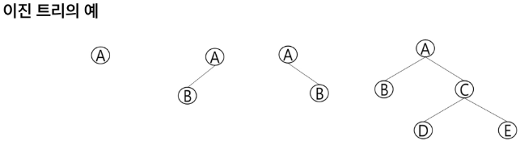
- 이진 트리의 특성
  - 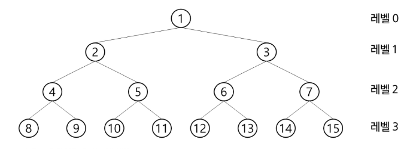
  - 레벨 i에서의 노드의 최대 개수는 2^i개
  - 높이가 h인 이진 트리가 가질 수 있는 노드의 최소 개수는 (h+1)개가 되며, 최대 개수는 (2^(h+1) - 1)개
- 포화 이진 트리 (Full Binary Tree)
  - 모든 레벨에 노드가 포화상태로 차 있는 이진 트리
  - 높이가 h일 때, 최대의 노드의 개수인 (2^(h+1) - 1)의 노드를 가진 이진 트리
    - 높이가 3일 때, 2^4 - 1 = 15 개의 노드
  - 루트를 1번으로 하여 2^(h+1) - 1까지 정해진 위치에 대한 노드 번호를 가짐
- 완전 이진 트리(Complete Binary Tree)
  - 높이가 h이고 노드 수가 n개일 때, 포화 이진 트리의 노드 번호 1번부터 n번까지 빈 자리가 없는 이진 트리.
  - 예) 노드가 10개인 완전 이진 트리
  - 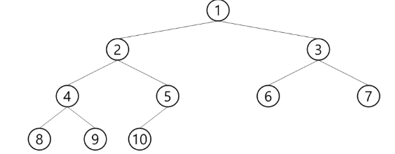
- 편향 이진 트리 (Skewed Binary Tree)
  - 높이가 h에 대한 최소 개수의 노드를 가지면서 한쪽 방향의 자식 노드만을 가진 이진 트리
    - 왼쪽 편향 이진 트리
    - 오른쪽 편향 이진 트리
    - 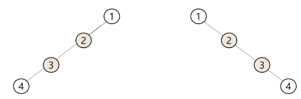
- 순회
  - 트리의 각 노드를 중복되지 않게 전부 방문(visit)하는 것
  - 3가지의 기본적인 순회 방법
    - 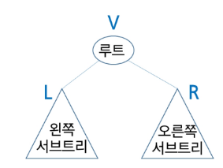
    - 전위순회(preorder traversal) : VLR
      - 자손 노드보다 현재 노드를 먼저 방문한다.
    - 중위순회(inorder traversal) : LVR
      - 왼쪽 자손노드, 현재노드, 오른쪽 자손노드 순으로 방문한다.
    - 후위순회(postorder traversal) : LRV
      - 현재 노드보다 자손 노드를 먼저 방문한다.
  - 전위 순회(preorder traversal)
    - 수행 방법
      - 1. 현재 노드 n을 방문하여 처리한다: V
      - 2. 현재 노드 n의 왼쪽 서브트리를 순회한다: L
      - 3. 현재 노드 n의 오른쪽 서브트리를 순회한다: R
    - 전위 순회 알고리즘
    - 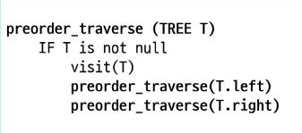
    - 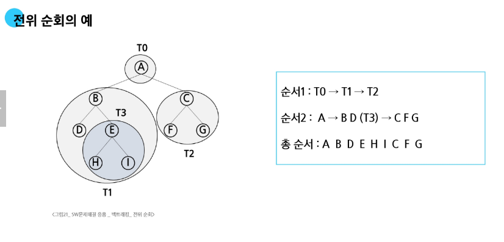
  - 중위 순회(inorder traversal)
    - 수행 방법
    - 1. 현재 노드 n의 왼쪽 서브트리를 순회한다: L
    - 2. 현재 노드 n을 방문하여 처리한다: V
    - 3. 현재 노드 n의 오른쪽 서브트리를 순회한다: R
    - 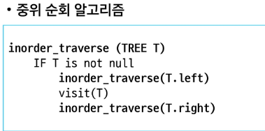
    - 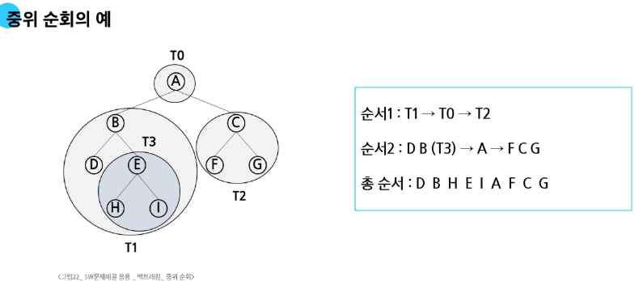
  - 후위 순회(postorder traversal)
    - 수행 방법
    - 1. 현재 노드 n의 왼쪽 서브트리를 순회한다: L
    - 2. 현재 노드 n의 오른쪽 서브트리를 순회한다: R
    - 3. 현재 노드 n을 방문하여 처리한다: V
    - 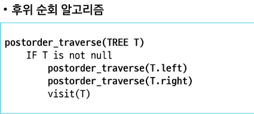
    - 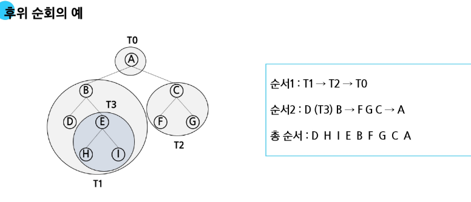
  - 배열을 이용한 이진 트리의 표현
    - 이진 트리에 각 노드 번호를 다음과 같이 부여
    - 루트의 번호를 1로 부여하고
    - 레벨 n에 있는 노드에 대하여 왼쪽부터 오른쪽으로 2^n부터 2^(n+1)-1 까지 번호를 부여
    - 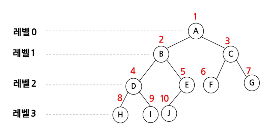
  - 노드 번호의 성질
    - 노드 번호가 i인 노드의 부모 노드 번호? i//2
    - 노드 번호가 i인 노드의 왼쪽 자식 노드번호? 2*i
    - 노드 번호가 i인 노드의 오른쪽 자식 노드번호? 2*i + 1
    - 레벨 n의 노드 번호 시작 번호는? 2^n
    - 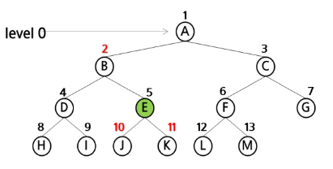 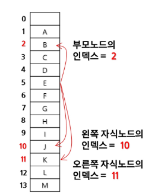
  - 배열을 이용한 이진 트리의 표현
    - 노드 번호를 배열의 인덱스로 사용
    - 높이가 h인 이진 트리를 위한 배열의 크기는?
      - 레벨 i의 최대 노드 수는? 2^i
      - 따라서 1 + 2 + 4 + ... + 2^i = 2^(h+1) - 1
    - 배열을 이용한 이진 트리의 표현의 단점
      - 편향 이진 트리의 경우 사용하지 않는 배열 원소에 대한 메모리 공간 낭비 발생
      - 트리의 중간에 새로운 노드를 삽입하거나 기존의 노드를 삭제할 경우 배열의 크기 변경 어려워 비효율적
      - 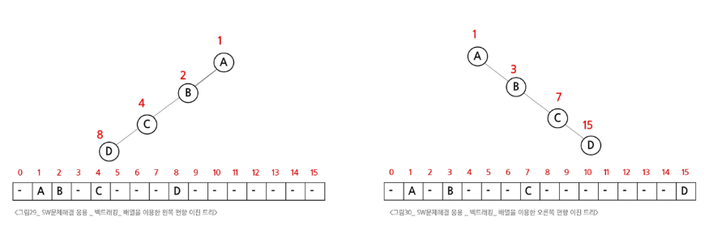
      - 위 단점을 보완하기 위해 연결리스트를 이용하여 트리를 표현할 수 있다.
  ## 연습 문제
  - 이진 트리를 전/중/후위 순회하고 방문한 노드의 번호를 출력
    - 첫 줄에는 트리의 노드의 총 수 V가 주어진다.
    - 그 다음줄에는 V-1 개의 간선이 나열된다. 간선은 그것을 이루는 두 정점으로 표기된다. 간선은 항상 "부모 자식" 순서로 표기된다.
    - 아래 예에서 두번째 줄 처음 1과 2는 정점 1과 2를 잇는 간선을 의미하며 1이 부모, 2가 자식을 의미한다
    - 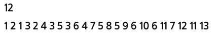
  ## 이진탐색트리(BST, Binary Search Tree)
  - 이진탐색트리
    - 탐색 작업을 효율적으로 하기 위한 자료구조
    - 모든 원소는 서로 다른 유일한 키를 가짐
    - key(왼쪽 서브트리) < key(루트 노드) < key(오른쪽 서브트리)
    - 왼쪽 서브트리와 오른쪽 서브트리도 이진탐색트리
    - 중위 순회하면 오름차순으로 정렬된 값을 얻을 수 있음
  - 탐색 연산
    - 루트에서 탐색 시작
    - 탐색할 키 값 x를 루트 노드의 키 값 k와 비교
    - x == k : 탐색연산을 성공한 경우이다
    - x < k : 루트 노드의 왼쪽 서브트리에 대해서 탐색연산을 수행합니다
    - x > k : 루트 노드의 오른쪽 서브트리에 대해서 탐색연산을 수행합니다
    - 서브트리에 대해서 순환적으로 탐색 연산을 반복
    - 탐색 수행할 서브 트리가 없으면 탐색 실패
  - 삽입 연산
    - 1. 먼저 탐색 연산을 수행
      - 삽입할 원소오 ㅏ같은 원소가 트리에 있으면 삽입할 수 없으므로, 같은 원소가 트리에 있는지 탐색하여 확인한다.
      - 탐색에서 탐색 실패가 결정되는 위치가 삽입 위치가 된다.
    - 2. 탐색 실패한 위치에 원소를 삽입
      - 다음 예는 5를 삽입하는 예이다.
      - 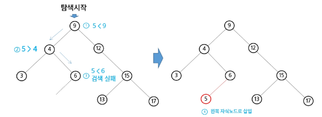
  - 삭제 연산
    - 삭제 연산에 대해 알고리즘을 생각해 봅시다.
    - 다음 트리에 대하여 13, 12, 9 를 차례로 삭제해보자.
    - 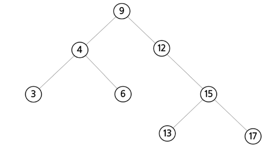
    - 13 삭제
      - 삭제할 노드가 리프 노드인 경우: 차수가 0인 경우
      - 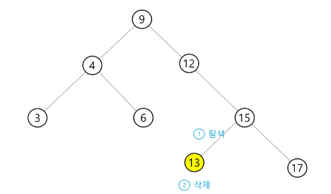
    - 12 삭제
      - 삭제할 노드가 리프 노드가 아닌 경우: 차수가 1인 경우
      - 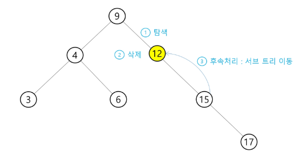
    - 9 삭제
      - 삭제할 노드가 리프 노드가 아닌 경우: 차수가 2인 경우
      - 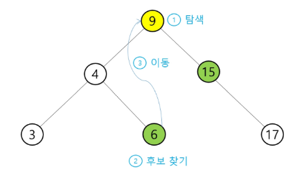
      - 삭제할 노드의 왼쪽서브트리중에 최댓값, 오른쪽서브트리중에 최솟값이 후보가됨.
  - 이진탐색트리의 성능
    - 탐색(searching), 삽입(insertion), 삭제(deletion) 시간은 트리의 높이만큼 시간이 걸린다.
      - O(h), h: BST의 깊이(height)
    - 평균의 경우
      - 이진 트리가 균형적으로 생성되어 있는 경우
      - O(log n)
    - 최악의 경우
      - 한쪽으로 치우친 경사 이진트리의 경우
      - O(n)
      - 순차탐색과 시간 복잡도가 같다
  ## 힙( heap )
  - 완전 이진 트리에 있는 노드 중에서 키 값이 가장 큰 노드나 키 값이 가장 작은 노드를 찾기 위해서 만든 자료구조
  - 최대 힙(max heap)
    - 키 값이 가장 큰 노드를 찾기 위한 힙이다.
    - 부모 노드의 키 값 > 자식 노드의 키 값
    - 루트 노드는 키 값이 가장 큰 노드이다.
  - 최소 힙(min heap)
    - 키 값이 가장 작은 노드를 찾기 위한 힙이다.
    - 부모 노드의 키 값 < 자식 노드의 키 값
    - 루트 노드는 키 값이 가장 작은 노드이다.
    - 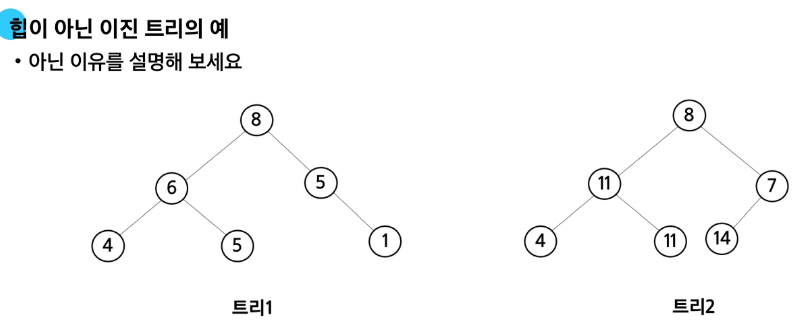
    - 트리1: 완전 이진트리가 아니다.
    - 트리2: 루트노드의 자식노드에 큰값과 작은값이 섞여있다.
  - 힙 연산 - 삽입
    - 17 삽입
      - 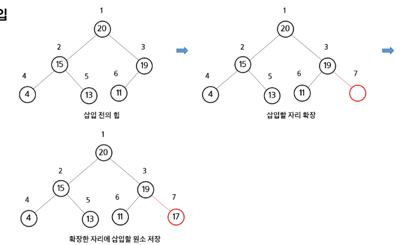
    - 23 삽입
      - 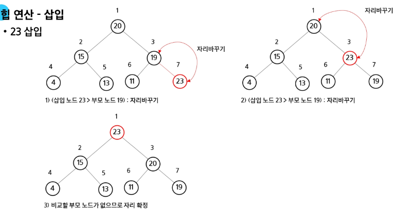
  - 힙 연산 - 삭제
    - 힙에서는 루트 노드의 원소만을 삭제할 수 있다.
    - 루트 노드의 원소를 삭제하여 반환한다.
    - 힙의 종류에 따라 최대값 또는 최소값을 구할 수 있다.
      - 우선순위 큐와 비교
    - 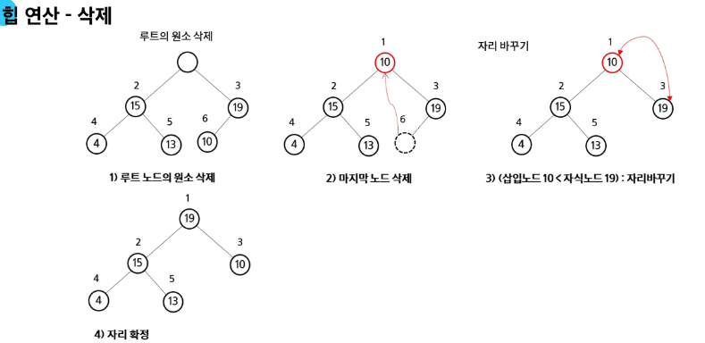
  - 힙의 활용
    - 힙을 활용하는 대표적인 2가지 예는 우선순위 큐의 구현과 정렬
    - 우선순위 큐를 구현하는 가장 효율적인 방법이 힙을 사용하는 것
      - 노드 하나의 추가/삭제가 시간 복잡도가 O(log n)이고 최대값/최소값을 O(1)에 구할 수 있다.
    - 힙 정렬은 O(n log n) 을 보장
    - 코드: 3.heap.py
    - 배열을 통해 트리 형태를 쉽게 구현 가능
      - 부모나 자식 노드를 O(1) 연산으로 쉽게 찾을 수 있다.
      - n번 위치에 있는 노드의 자식은 2n과 2n+1번에 위치한다.
      - 완전 이진 트리의 특성에 의해 추가/삭제의 위치는 자료의 시작과 끝 인덱스로 쉽게 판단할 수 있다.