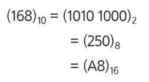
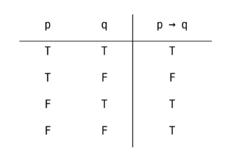
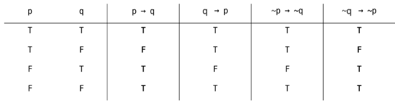

# 진법
- 2진수, 8진수, 10진수, 16진수
  - 10진수: 사람이 사용하는 진수, 수 하나를 0~9로 표현
  - 2진수: 컴퓨터가 사용하는 진수, 수 하나를 0,1로 표현
  - 8진수: 2진수를 더 가독성 있게 사용
  - 16진수: 2진수를 더 가독성 있게 사용, 수 하나를 0,1,2,...,8,9,A,B,C,D,E,F
  
- 왜 16진수를 사용하는 것인가?
  - 2진수를 사람이 이해하기 편하도록, 10진수로 변환 시
    => 인간이 이해하기 편하지만, 연산이 오래걸림.
  - 2진수를 사람이 이해하기 편하도록, 16진수로 변환 시
    => 인간이 이해하기 어렵지만, 연산 속도가 매우 빠름.
  # 조건명제
  - p,q가 명제일 때, 명제 p가 조건(원인), q가 결론(결과)으로 제시되는 명제
  - p → q (p이면q이다)
  
  - 조건명제의 역,이,대우
  - 주어진명제: p → q
  - 역: q → p
  - 이: ~p → ~q
  - 대우: ~q → ~p
  