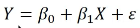
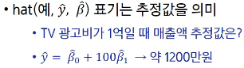
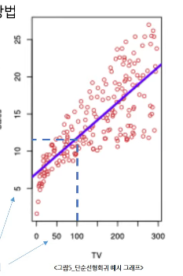
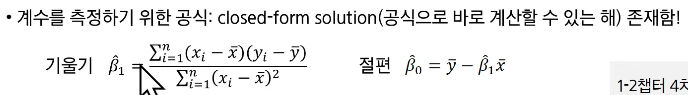
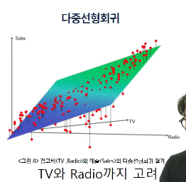
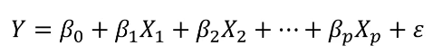
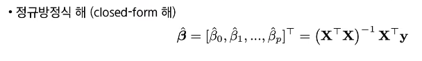
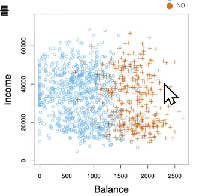

# 학습시작
- 실제 응용 사례
  - 광고비와 매출액의 상관 관계 분석
  - 고객 소득,소비 패턴을 활용한 신용점수 산출

## 선형회귀
직선 형태로 근사
가장 기본이 되는 접근 방법
단순해보이지만, 개념적으로도 실무적으로도 매우 유용하다.
- 단순선형회귀
  - input(x)가 하나인 선형회귀 (직선)
  - 모형가정: 참함수
  - 
  -  
- 최소 제곱법
  - 실제 관측값과 예측값의 차이(잔차) 를 제곱해 합한 값(RSS, 잔차제곱합)을 최소화하는 방법
  - RSS를 최소화하는 기울기와 절편을 찾는 문제.
  - 그 기울기와 절편을 측정하기 위한 공식이 존재.
  - 
- 단순선형회귀: 광고 데이터
  
- 다중선형회귀
  - 인풋값이 여러개.
  - 
  - 
  - 

- 선형회귀 주의사항
  - 4.1 검증/테스트셋 데이터를 활용한 성능 평가
    - 선형모델 또한 과적합 문제 가능성
    - 교차검증 필요
  - 4.2
    - 인풋들이 서로 연관되어있다면 혼란발생
    - 좋은 선형모델이란: 데이터들이 잘 잡아줘서 이 판자를 hold 해주는것.
    - 데이터들이 한쪽에 치우쳐있으면 판자가 흔들거린다.
    - 아이스크림소비량(X), 상어에물리는사건(Y) X가 증가하면Y도 증가하지만 사실 둘은 상관관계가 없다.
    - 둘다 여름에 일어나는 일이기때문에 상관있어 보일 뿐이다.

## 분류
- 범주형 변수
- 
- 우도(Likelihood): 현재 확률함수가 데이터를 얼마나 잘 설명하는지에 대한 지표
- MLE(Maximum LE): 

## 경사 하강법
- 기울기의 반대방향으로 이동한다.
- 
