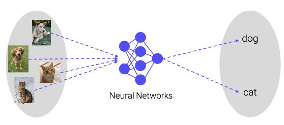
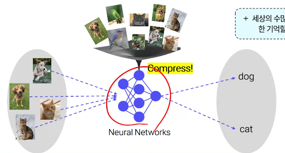
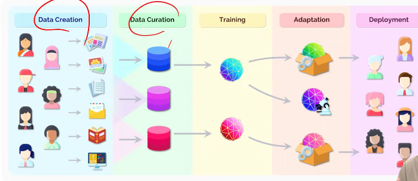
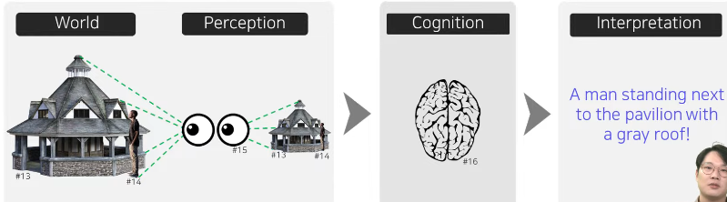
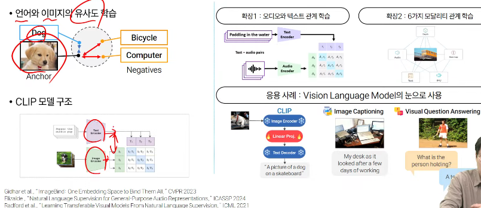

# 학습 목표
- AI 파운데이션 모델의 개념으 ㄹ이해하고 특징을 설명할 수 있다.
- Pre-tra..

## 1-1. 파운데이션 모델(Foundation model) 이란?
- AI모델
  - 함수 또는 프로그램
  - 입출력을 연결해주는 함수 + 데이터로 학습된 함수 + 학습 때 보지 못했던 데이터에 대해서도 작동해야하는 의무
  - 예시: 뉴럴넷 / 입력=>뉴럴넷=>출력
  
  - 이상적인 AI 모델
    - 만약 AI모델이 이 세상에서 발생 가능한 [모든 데이터]와 [각 데이터의 설명]을 모두 기억하고 있다면?
    - 내가 얻고 싶은 답과 유사한 답이 이미 DB에 저장되어 있을 확률이 높음 => 검색 엔진과 유사
    - 예시: 최근접 이웃 탐색(Nearest Neighbor Search) 알고리즘
    - 그러나, 데이터 확보, 저장, 탐색은 매우 비용이 크고 현실적이지 않음
  - 현실적인 기계학습 모델
    - 학습 = AI모델에 데이터를 패턴화 하여 압축
    - 이 과정에서 비슷함과 다름을 파악하게 되고, 패턴을 익히면서 새로운 데이터에 대한 일반화 능력이 생김
    
  - 파운데이션 모델이란?
    - 대규모 데이터를 폭넓게 학습한 후, 다양한 문제에 빠르게 적용할 수 있는 범용 대형 AI 모델
  - 파운데이션 모델
    - 기존 딥러닝 개발 패러다임: 아기와 같이 언어,시각,청각,촉각 등 기본적인 것들부터 배워나가야함.
    - 파운데이션 모델 패러다임: 거대모델(커다란뇌) + 대규모 데이터 학습(많은지식과경험) 기반
    - 파운데이션 모델 기반 개발 프로세스
    - 
  - 파운데이션 모델의 특징
    - 특징1[대규모]: 트랜스포머 모델 + 대규모 언어 데이터 학습
      - 테스크에 상관없이 비슷한 패턴들이 등장하고 있음.
      - 주로 비지도학습으로 훈련된 모델들"도" 많이 등장(의미하는 바: 쉬운데이터수집+대규모학습)
    - 특징2[적응성]: 높은 파인튜닝 성능 (높은 태스크 적응 성능)
      - 믿고 쓸 수 있는 모델
    - 특징3[범용성]: 다양한 작업, 한정되지 않는 출력 지원
  -  파운데이션 모델에 의한 AI 모델 개발의 변화
     -  과거에는 매번 모델을 새로 학습했지만, 이제는 잘 학습된 모델들을 얼마나 잘 활용하느냐가 핵심
     -  파운데이션 모델 하나 확보하는데 투여되는 계산 리소스는 일부 대규모 인프라 이외에 불가
     -  적응 활용
        -  활용되는 기법들: 프롬프트{엔지니어링,튜닝}, 전이학습, 적응학습, 파인튜닝
           -  Zero-shot : 처음보는 문제를 추가 학습 없이 바로 적용(모델 자체가 가진 배경지식 활용)
           -  Few-shot : 예제 몇 개만 보여주면 바로 적용 가능
           -  Fine-tuning : 처음부터 배우지 않아도, 조금만 알려주면 금방 적응(모델 자체를 업데이트, 모델 가중치가 변경됨.)
  - 대표적 파운데이션 모델
    - Human-like Ai를 향해서
      - Human's Intelligence(cognition) = perception u higher cognitive processes
        - AI는 사람의 지능과 유사점/차이점 분석을 통해 발전
        
        - 2022년 11월 이전: 각 분야별로 지능의 매우 부분적 능력만을 개별적으로 모델링 시도
        - 2022년 11월 (Chat GPT) 이후: 대규모 언어모델(LLM)이 높은 사고/추론 성능을 보여주기 시작 (다양한 인지 능력 벤치마크에서 인간 수준 근접)
        - LLM에 눈을 달아볼까? (시각언어모델)
        - 
        - ChatGPT(2023)
          - 자연어 입력에 국한된 기존의 거대 언어 모델에서 더 나아가 이미지,문서,음성 등 멀티모달 데이터를 처리할 수 있는 모델
          - ChatGPT(2023) 를 활용하여 다양한 도메인의 이미지 머시기
          - Sketch-to-web page (HTML)
        - Claude 기반 Coumputer use 기능 시연 - 친구와의 여행 플랜 세우기
          - 수많은 컴퓨터 프로그램의 다양한 인터페이스를 이해하기 위해서는 시각 이해도 필요
          - CLIP(2021) by OpenAI
            - 
            - AI가 언어와 시각을 통합해서 이해하는 방식을 보여준 패러다임 전환 제시
            - 파운데이션 모델으로써의 특징 
              - 입력: 학습하지 않은 새로운 도메인의 입력 데이터에 대해서도 좋은 성능을 발휘(제로샷 전이)
              - 출력: 자연어를 이용해 한번도 본 적 없는 카테고리도 텍스트 설명만으로 출력 정의 가능(언어 인터페이스)
            - 대조 학습 기반의 언어-이미지 사전 학습
              - 인터넷 데이터를 통한 지도 학습을 통해 자연어 기반 시각 개념 학습
              - 다양한 이미지-자연어 쌍으로 학습
                - 인터넷에서 수집된 4억개의 이미지-텍스트 쌍
                - Alt-text HTML tag 이미지캡션,제목 등을 기반으로 수집
                - 데이터 정제 과정을 거침 (중복 이미지, 해상도/품질 낮은 이미지,짧은 텍스트 등)
            - CLIP구조 - 텍스트인코더
              - Remind - Transformer
                - 트랜스 포머 구조 = 인코더 + 디코더
                - CLIP에서는 인코더온리사용
                - 토큰 이라는 단위의 입력
                - 입력된 토큰 간의 관계성에 집중하는 Attention 메커니즘으로 구성
                - L 길이의 입력 토큰은 D-차원 특징벡터(임베딩)의 배열로 형태로 입력
                - 자연어 데이터
                  - Sub-...
              - Remind - Vision Transformer
                - 입력 구성
                  - 텍스트 인코더(자연어 데이터 입력) : Sub-word 단위의 임베딩
                  - 이미지 인코더(이미지 데이터 입력) : 패치 단위의 임베딩
                - ViT : 비전 분야에 트랜스포머를 (최소 수정으로) 적용한 모델
                - 이미지를 작은 패치(16X16X3)로 나눔
            - clip학습
              - 대조학습(Cont)

놓침....

## SigLIP(2023)
- CLIP 대비 SigLIP이 압도적인 성능을 보이며 최신 VLM에 널리 활용됨

## 멀티모달 정합 응용
- 멀티모달 정합
  - 서로 다른 두 가지 이상의 모달리티(예: 이미지와 텍스트)간의 공통된 임베딩 벡터 공간을 구성하는 것
  - 서로 다른 모달리티 임베딩 간 유사도(연관성) 비교 가능
  - 대표적인 모델:
    - CLIP(OpenAI) : 이미지와 텍스트 간의 Multi-modal Alignment를 효과적으로 수행
    - ImageBind(Meta): 
- VLM의 눈으로 응용
  - CLIP 기반 VLM들 리스트
  - SigLIP 기반 VLM들 리스트

놓침....
## 3-3 최신 공개 VLM 모델들 - Qwen - VL (Alivava)
 
## 3-4 도메인 특화 파운데이션 모델들 - 의료
