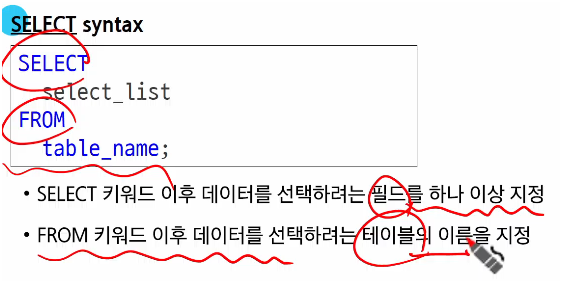
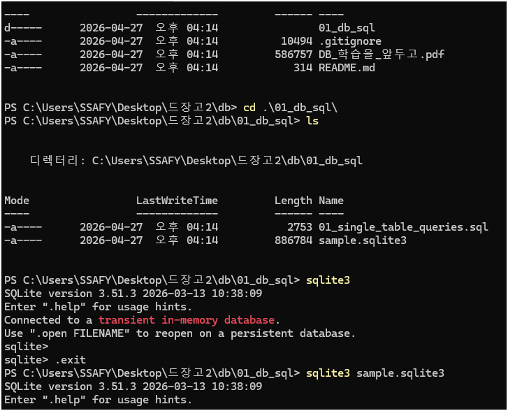
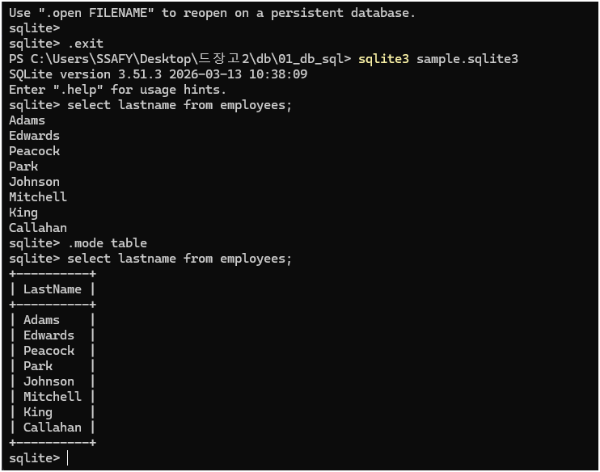

# 데이터베이스
- 체계적으로 정리된 데이터의 모음
- 데이터
  - 저장이나 처리를 위해 변환된 정보
- DIKW 피라미드
  - Data: 37.5 (그냥 숫자)
  - Information: 체온 37.5 (의미 부여)
  - Knowledge: 37.5도는 미열 (해석)
  - Wisdom: 미열이면 약을 아직은 안먹어도 된다 (판단)
- 증가하는 데이터 사용량
- 1. 파일(File)이용
  - 데이터를 구조적으로 관리하기 어려움
- 2. 스프레드시트 이용
  - 테이블의 열과 행을 사용해 데이터를 구조적으로 관리 가능
  - 스프레드 시트의 한계
    - 크기: 일반적으로 약 100만행까지 저장가능
    - 보안:
    - 정확성: 데이터변경 시 문제
## Relational Database (관계형 데이터베이스)
- 데이터베이스 역할
  - 데이터를 저장(구조적 저장)하고 조작
- 관계형 데이터베이스
  - 테이블,행,열의 정보를 구조화하는 방식
- 관계
  - 여러 테이블 간의 (논리적) 연결
- 관계형 데이터베이스 예시
  - id이용 -> Primary key
- 관계형 데이터베이스 관련 키워드
  - Table (aka Relation)
    - 데이터를 기록하는 곳
  - Field
    - 각 필드에는 고유한 데이터형식이 지정됨
  - Record(Row, Tuple)
    - 구체적 데이터 값 저장
  - Database
    - 테이블의 집합
  - Foreign Key (외래 키)
    - 테이블의 필드 중 다른 테이블의 레코드를 식별할 수 있는 키
- RDBMS
  - DBMS(Database Management System)
    - 데이터베이스 관리하는 소프트웨어 시스템
  - RDBMS 서비스 종류
    - SQLite
    - MySQL
    - PostgreSQL
    - Oracle Database(기업이 대규모로할떄씀)
  - SQLite
## SQL
- SQL Syntax
  - 1. 대소문자 구분 안하지만, 대문자 작성 권장
  - 2. 마침표는 세미콜론 (;)
- 수행목적에 따른 SQL Statements 4가지 유형
  - DDL : CREATE, DROP, ALTER
  - DQL : SELECT
  - DML : INSERT, UPDATE, DELETE
  - DCL : 다루지않음
## SELECT
- 
- SELECT 활용 1

## DISTINCT
- SELECT 키워드 바로 뒤에 작성하여야 함
- 중복제

## WHERE
- FROM밑에
- IF문같은느

#

