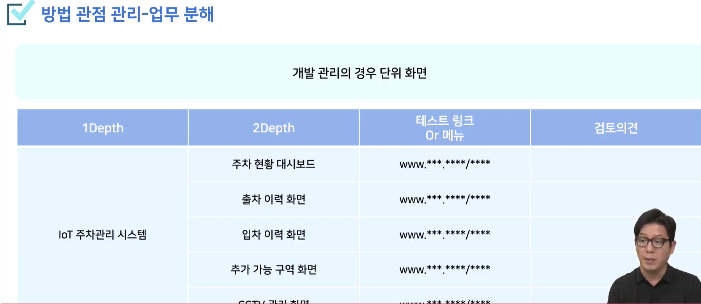
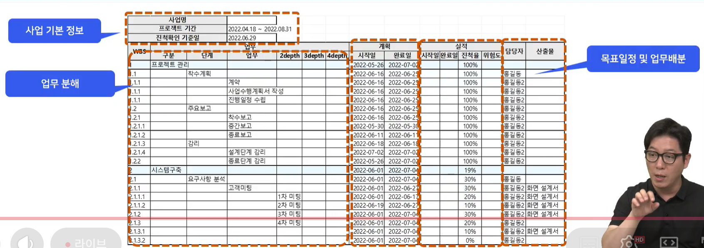
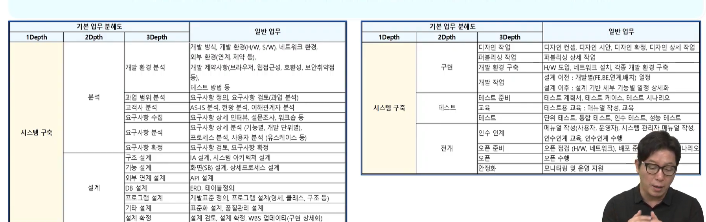
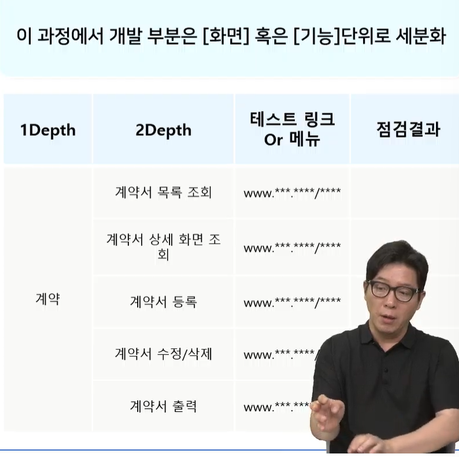

프로젝트 진행 후 구성원 역할 분배
역할에 따른 수행 및 진척 관리
프로젝트 진행 중 발생하는 갈등 및 문제 해결

# 방법 관점 관리
- 업무 분해
(분석/설계 -> 디자인 -> 개발 -> 테스트 -> 오픈 -> 안정화)(개발은 지척을 확인할 수 잇는 기준이 되는 최소 단위까지.보통은 화면단위)(설계에서의 전체그림을 하나하나 목록화 하는 작업)

각각의 역할,페이지 구현사항을 잘 구현했는지 검토.

- 역할분배,일정계획
아, 업무분해를 먼저(목록화) 하고 맴버별로 역할과 일정분배 보통은 PM이 분배.
1차 업무분배에 대해 구성원리뷰.(진행에대한어려움, 과한업무,부족한업무, 개인상황에 대한 고려 등)-이걸 다같이있을떄 리뷰하기(공평한협의가능)

- 보고
정규적보고를 통한 PM이 진행관리(구성원의 능동적 보고) - PM이 하나하나 확인하면 비효율적
PM은 보고를 통해 발생하는 다양한 문제해결에 집중
- 일정 및 변화 관리
빠른처리,느린처리 하는 사람에 따른 업무분배와 성과배분.
WBS라는 문서를 통해 관리.

# 권한 관점 관리
PM 통한 수직적 권한과 책임을 기반으로 관리
수직적 권한
책임: 부여받은 권한에 대해 성공/실패에 대한 최종 책임
PL: 부반장
구성 멤버: 
?: 수직적 관리와 수평적관리 중 어디서 갈등 더 많을까?

# 규칙 관점 관리
반복적문제 미리 합의된 규칙으로 적용함으로써 효율적 대응
규칙은 '규정','가이드','문화'로나뉨
규정: 누군가의 일방적인 불합리한 행동 시 대응 규정
가이드: 디테일과정에서의 갈등(퍼블리싱(버튼눌러지는지)과 프론트앤드 개발 범위. 나에게 어떤 자료를 넘겨줄떄는 이 수준까지 구현 등 약속)
문화: 의견 충돌 발생 시 문화를 기반으로 문제 대응

3. 단기 프로젝트 조직 특성
단기는 프로젝트 관리 방법 미경험
- 역할 분배가 마음에 안들어요. 팀리더가 제대로 관리를 해주지 못해요.
비교적 약한 강제성
- 팀원이 해야할일을 포기해 버렸어요.
비교적 수평적 관계
- 갈등에 대해 누구도 중재를 못해요.
문제 대응 규칙이 부재
- 별거아닌 문제가 눈덩이
같은 기능이라도 그렇게 잘만드는게 영향력낮음
- 특정멤버가 일을 대충하는데 관리x
-> 그래서 맞춤형 관리방안이 필요
첫번째, 방법
- 배움을 통해 습득
두번쨰, 권한
- PM대신 협의된 방법에 권한 부여.
세번쨰, 규칙
- 그라운드룰의 구체화(약속)

MVP는 Minimum Viable Product, 한국말로는 최소 기능 제품(토스를 예를들면 송금을 간편하게하는게 핵심기능이고, 고객층이 금융관련 층이니까 그쪽으로 확장하는 형ㅇ식)

기술 리더 선정: 팀원들의 투표를 통해 기술력(50),소통역량(50) 즉 기술을 기반으로 원활한 업무분배가 가능한 사람(즉, 팀장과 기술리더에게 기본적인 권한을 부여(마음속의 진심담긴 존중), PM에 준하는 권한은 아님)

위 사진 기반으로 추려서 업무분해를 진행(팀장과 기술리더가 집중하여 수행)
AI에게 가이드를 받고 거기서 의미잇다 하는거만 뽑아내서 업무분해

팀장&기술리더의 상의를 통한 1차 역할 및 일정 분배
업무 분배 기반(역할,일정) 계획 자료 팀원 사전 공유 후 검토
1차 역할 및 일정 분배 내역 전체 팀원 리뷰 후 확정
확정된 역할&일정에 대한 전체구성원의 확인(노션 등 전체가 확인가능하도록 공지)
각 팀원은 전체 분배 내역을 사저리뷰하여 의견 가지고 올것
역할에 대한 의견- 이게하고싶다,이건어렵다, 범위에 대한 의견- 이건무리같아요, 저는 더하고싶어요
각구성원 위험요소 미리 공유(취업준비,개인사정) - 그러나 불공평한 분배가능성=>자율협의 하되 조율안되면 팀장,개발리더가 결정
[목표기여도]와 [최종기여도]를 지라에 정리-성취감과 성취도 가시적으로 보고 감사인사 등
팀장,개발리더가 문제상황 파악하는게 아니라 개발구성원이 공유하는 것임을 인지해야함(즉, 파악못한 누군가가 있는게 아니라 공유하지 않은 누군가가 있는형태)
보고는 형식화된 것이 아니라, 실질적이어야 하고 간단.
기본은 [주간보고]인데 단기는 데이리스크럼 등의 방법 활용
일정 진척 지연 여부(Y or N 목표%, 수행%)
진행 이슈(진행중 어려움)
변경사항(진행중 변경된 내용 혹은 변경 필요 사항)
지원요청(진행 중 도움이 필요한 상황)

팀장과 개발리더는 현재 사용하는 관리 툴을 이용해서, [작업 진척 파악]과 [변경 사항 파악] 가능하도록 구성

[만약 규칙 외의 갈등 상황 발생한다면] 우리는 [이런 규칙을 통해서 해결하자]라고 갈등이 발생하기 전 사전 약속 - 예를들어 다수결,팀장과기술리더의 협의를 통한 결정

핵심은 '문제발생 전'에 각자의 이해관계가 없는 편안한 상태에서 [규칙]을 세우는 것이 핵심(그라운드룰)

2. 자주 발생 사례별 대응 방안
- 진척의 지연 시: 좀 더 여유로운 사람에게 넘겨주고 베니핏(고맙다는말도 가능)주기.
- 정보를 공유하지 않아 발생되는 문제: 

- 규칙
의욕의차이
    : 최소치와 최대치를 정의(최소치는 의무, 최대치는 베니핏)
역량의차이
    :역량차이에 따른 차등적 업무 분배할지 동일한 업무분배할지(배려와 존중)
책임의부재
    : 어쩔 수 없는 개인사정으로 인한 부재는 발생하면 안된다는 컨셉이 아니라 빨리 공유하고 빨리 대응하자는 컨셉. 일정을 다시 조정.
관계의문제
    : 갈등은 자연스러움. 서로가 상대에게 직접적 표현 자제를 미리 약속. 이미 갈등발생 시에는 코치에게 상황 알리고 중재요청을 약속. 코치의 조정방향에 따르기.
표현의문제
    : 중재자 결정 후 1:1로 내용과 의견전달. 자신의 불편함을 중재자에게 전달.

AI에게 미리 발생가능한 갈등을 알려달라하기.

3. 가장 중요한 규칙
- 가장 중요한 것은 [존중]임.
- 서로가 다름에 익숙하지 않아서 발생하는 문제
- 아무리 좋은 방법과 규칙이 있어도 서로를 존중하지 않으면 의미가 없음.

# 가민코치님
요구사항 정의서
ERD 클라우드
API 명세서
Swagger, Postman
프론트: 피그마
유저플로우: 어떤 화면에서 어떤화면으로 이동하는지 화살표로 정리
