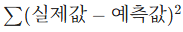

# 1차시
1. AI, ML, DL의 정의 및 관계
   - 인공지능, 머신러닝, 딥러닝은 별개의 개념이 아니라 포함 관계를 가집니다.
     - 인공지능(AI): 인간의 지능을 모방하여 스스로 판단하고 학습하는 시스템 전체를 아우르는 가장 넓은 개념.
     - 머신러닝(ML): AI의 한 분야로, 사람이 일일이 규칙을 코딩하는 대신 데이터를 통해 컴퓨터가 스스로 학습하여 패턴을 찾아내는 방식
     - 딥러닝(DL): 머신러닝의 하위 분야로, 인간의 뇌 구조를 모방한 인공신경망(Neural Network) 알고리즘을 사용하여 복잡한 데이터를 처리하는 기술입니다.

2. 데이터 구성 요소 (Feature & Label)
   - 모델이 학습하기 위해 데이터는 크게 두 가지 성분으로 나뉩니다.
     - 피처(Feature): 모델이 예측을 하기 위해 사용하는 입력 변수입니다.
     - 라벨(Label): 모델이 맞추어야 하는 "정답"입니다.
     - 학습 과정은 피처와 라벨 사이의 관계(함수)를 찾아가는 과정이라고 볼 수 있습니다.

3. 회귀 (Regression)
   - 정의: 지도 학습의 한 종류로, 출력값(라벨)이 연속적인 수치인 문제를 해결하는 방법
   - 예시: 내일의 기온 예측, 주가 예측, 키에 따른 몸무게 예측 등이 해당합니다.
   - 평가: 실제값과 모델이 예측한 값의 차이(오차)를 줄이는 방향으로 학습하며, 주로 MSE(평균제곱오차)를 평가지표로 활용합니다.

4. 회귀 설명력: R^2 (결정계수)
   - 의미: 회귀 모델이 전체 데이터의 변동성을 얼마나 잘 설명하는지를 나타내는 지표입니다.
   - 해석: 0에서 1 사이의 값을 가지며, 1에 가까울수록 모델이 데이터를 완벽하게 설명한다는 뜻입니다.
   - 단순히 오차의 크기만 보는 것이 아니라, "이 모델이 평균으로 예측하는 것보다 얼마나 더 나은가?"를 보여주는 상대적인 성능 지표입니다.

5. 혼동행렬 (Confusion Matrix)
   - 분류(Classification) 모델의 성능을 다각도로 평가하기 위해 사용하는 표입니다.
   - 구성 요소:
     - TP(True Positive): 양성(P)을 양성이라고 맞게 예측함.
     - TN(True Negative): 음성(N)을 음성이라고 맞게 예측함.
     - FP(False Positive): 음성인데 양성이라고 틀리게 예측함(1종 오류)
     - FN(False Negative): 양성인데 음성이라고 틀리게 예측함(2종 오류)
   - 활용: 혼동행렬을 통해 "정확도"뿐만 아니라, 상황에 따라 더 중요한 "정밀도"나 "재현율"을 계산하여 모델의 약점을 파악할 수 있습니다.

## 추가팁
- 강의 내용에 따르면, 모델이 훈련 데이터에 너무 과하게 맞춰져 실제 데이터에서 성능이 떨어지는 "오버피팅"을 경계해야 하며, 이를 해결하기 위해 데이터를 나누어 학습과 검증을 반복하는 "교차 검증"이 중요하게 언급되었습니다.

# 2차시
1. RSS(Residual Sum of Squares)의 뜻과 정의
   - 정의: 우리말로 "잔차 제곱합"이라고 합니다. 회귀 모델에서 실제 정답값과 모델이 예측한 값의 차이(잔차,Residual)을 제곱하여 모두 더한 값입니다.
   - 용도: 모델이 얼마나 데이터를 잘 맞추지 못하고 있는지 보여주는 '지표'입니다. RSS 값이 작을수록 모델이 데이터가 가깝게 예측하고 있다는 뜻입니다.
   - 수식적 의미: 
  
2. 손실 함수(Loss Function)
   - 정의: 모델이 학습하는 과정에서 "지금 내 모델이 얼마나 틀리고 있는가?"를 수치화한 함수입니다.
   - 회귀와 손실 함수: 회귀 분석에서는 방금 설명한 RSS를 데이터 개수로 나눈 MSE(평균 제곱 오차)를 주로 손실 함수로 사용합니다.
   - 목표: 인공지능 학습의 최종 목적은 이 손실 함수의 값을 최소화하는 최적의 파라미터(가중치)를 찾는 것입니다.

3. 경사 하강법 (Gradient Descent)
   - 정의: 손실 함수의 값을 최소로 만드는 파라미터를 찾기 위해, 함수의 기울기(경사)를 따라 조금씩 내려가는 최적화 알고리즘입니다.
   - 작동 원리: 현재 위치에서 기울기가 가파른 방향의 반대쪽으로 이동하며 골짜기의 가장 낮은 지점을 찾아갑니다.
   - 비유: 안개가 낀 산에서 가장 낮은 골짜기를 찾기 위해, 발밑의 경사가 낮은 쪽으로 한걸음씩 내딛는 과정과 같습니다.

4. 로지스틱 회귀 (Logistic Regression)
   - 정의: 이름은 "회귀"지만 실제로는 "분류"를 위해 사용되는 알고리즘입니다.
   - 특징: 입력 데이터를 바탕으로 특정 사건이 발생할 확률을 0과 1사이의 값으로 예측합니다.
   - 시그모이드 함수: 어떤 숫자가 들어와도 0~1 사이의 확률값으로 변환해주는 특수한 함수를 사용하여, "이 데이터는 A 그룹에 속할 확률이 80%다"와 같은 판단을 내립니다.

5. 신경망(Neural Network)
   - 정의: 인간의 뇌 세포인 "뉴런"이 신호를 전달하는 구조를 본뜬 수학적 모델입니다.
   - 구조: 입력층(Input Layer), 은닉층(Hidden Layer), 출력층(Output Layer)으로 구성됩니다.
   - 핵심: 각 층의 연결 통로에는 "가중치"가 있으며, 학습이란 앞서 언급한 '경사 하강법'을 통해 이 가중치들을 조절하여 모델의 예측 오차를 줄여나가는 과정입니다.

# 3차시
1. RNN (Recurrent Neural Network) 원리 이해
   - 원리: 자연어와 같은 시퀀스 데이터를 처리하기 위해, 이전 단계의 계산 결과(Hidden S)를 다음 단계의 입력으로 다시 사용하는 '재귀적'구조를 가집니다.
   - 강의 내 핵심: "기존의 데이터는 독립적이라고 가정하지만, 언어는 앞 단어가 뒤 단어에 영향을 준다"는 점을 강조합니다. 하지만 문장이 길어질수록 앞쪽의 정보가 희미해지는 Gradient Vanishing(기울기 소실) 문제가 발생한다고 설명합니다.

2. LSTM(Long Short-Term Memory) 원리 이해
   - 원리: RNN의 정보 소실 문제를 해결하기 위해 Cell State라는 "정보 고속도로"를 도입했습니다.
   - 강의 내 핵심: 잊어버릴것(Forget), 저장할 것(Input), 내보낼 것(Output)을 결정하는 Gate(게이트)구조를 통해 과거의 정보도 효율적으로 전달합니다. 스크립트에서는 이를 통해 "긴 문맥의 의존성을 파악할 수 있게 되었다"고 언급합니다.

3. Transformer 원리 이해
   - 원리: RNN처럼 순서대로 읽지 않고, 문장 전체의 단어들을 한꺼번에 처리하는 Self-Attention 매커니즘을 사용합니다.
   - 강의 내 핵심: "Attention is all you need" 라는 논문 제목처럼, 특정 단어를 해석할 때 문장 내 단어들과의 '관련성'을 점수로 매겨 핵심 정보를 추출합니다. 순차적 계산이 필요 없으므로 병렬 처리가 가능해져 대규모 학습이 가능해졌음을 강조합니다.

4. BERT 원리 이해
   - 원리: Transformer의 Encorder 부분만을 쌓아 만든 모델로, 문장을 양방향으로 동시에 문맥을 파악합니다.
   - 강의 내 핵심: 
     - Masked Language Model(MLM): 문장의 일부를 가리고 주변 단어로 빈칸을 맞추는 연습을 통해 언어를 배웁니다.
     - Pre-training & Fine-tuning: 방대한 데이터로 미리 언어 능력을 학습(사전 학습)한 뒤, 특정 목적(분류, 감성 분석 등)에 맞게 살짝 수정하여 사용하는 효율적인 방식을 제시합니다.

5. NLP 성능 평가 (Evaluation)
   - 강의 내 핵심: 자연어 처리는 정답이 하나가 아니기 때문에 평가가 어렵다는 점을 언급합니다.
     - Perplexity(PPL): 언어 모델이 다음 단어를 예측할 때 얼마나 헷갈리는지(확률적 혼란도)를 측정합니다. 낮을수록 좋습니다.
     - BLEU / ROUGE: 사람이 쓴 정답 문장과 모델이 만든 문장의 단어가 얼마나 겹치는지를 수치화하여 번역이나 요약 성능을 평가합니다.
     - Human Evaluation: 결국 최종적으로는 사람이 보기에 얼마나 자연스러운지를 정성적으로 평가하는 과정도 중요하게 다뤄집니다.

# 4차시
1. 디코딩 알고리즘
   - 모델이 학습을 마친 후, 실제로 문장을 "생성"해낼 때 다음 단어를 선택하는 방법입니다.
   - 그리디 서치: 매순간 가장 확률이 높은 단어 하나만 선택합니다. 가장 단순하지만, 뒤로갈수록 문장이 어색해지거나 반복되는 단점이 있습니다.
   - 빔 서치: 한 번에 여러개의 후보를 유지하며 가장 그럴듯한 문장 조합을 찾습니다. 그리디보다 성능이 좋아 표준적으로 많이 쓰입니다.
   - 샘플링: 확률 분포에 따라 랜덤하게 단어를 뽑습니다. 이때 '온도'라는 설정을 사용하는데, 온도가 높으면 더 창의적이고 다양한 답변이 나오고 낮으면 보수적이고 정확한 답변이 나옵니다.

2. 선호 학습
   - 모델이 단순히 다음 단어를 잘 맞추는 것을 넘어, '사람이 좋아하는 방식'으로 대답하도록 가르치는 과정입니다.
   - 왜 하나요?
     - AI가 지식은 많아도 말투가 무례하거나, 위험한 정보를 알려줄 수 있기 때문입니다. 사람의 가치관에 맞게 '정렬'하는 작업입니다.
     - RLHF(Reinforcement Learning from Human Feedback)
       1. AI가 만든 여러 대답 중 사람이 어떤 게 더 좋은지 순위를 매깁니다.
       2. 이 순위를 바탕으로 '보상 모델'을 만듭니다.
       3. AI는 이 보상을 더 많이 받기 위해(칭찬받기 위해) 자신의 대답 방식을 수정하며 학습합니다.

3. 거대 언어 모델(LLM)의 평가
   - 모델이 얼마나 똑똑한지 측정하는 방법입니다. 과거보다 훨씬 복잡해졌습니다.
   - 벤치마크 평가(MMLU 등): 수학, 역사, 법률 등 객관식 문제를 풀게 하여 지식 수준을 점수로 매깁니다.
   - 벤치마크의 한계: 최근 모델들이 벤치마크 문제 자체를 학습 데이터로 미리 봐버리는 '오염(Contamination)' 문제가 있어 점수만으로 판단하기 어려워졌습니다.
   - 상대 평가(Chatbot Arena): 두 모델의 답변을 나란히 두고 사람이 직접 "어떤 답변이 더 나은가?"를 투표하여 등수를 매기는 방식(Elo 레이팅)이 가장 신뢰받고 있습니다.
   - LLM-as-a-judge: 사람이 일일이 평가하기 힘드니, GPT-4 같은 아주 똑똑한 모델에게 다른 모델의 답변을 채점하게 시키기도 합니다.

# 5차시
1. CNN (Convolutional Neural Network) 원리 이해
   - 왜 쓰나요?
     - 일반적인 신경망은 이미지 데이터를 1열로 길게 펼쳐서 입력해야 하므로, 이미지 속 물체의 '위치'나 '모양' 정보(공간적 구조)가 깨집니다.CNN은 이미지를 있는 그대로(2D)로 받아들여서 특징을 찾아내기 위해 고안되었습니다.
   - 핵심 개념: 이미지 전체를 한꺼번에 보는 게 아니라, 작은 '필터'가 이미지를 훑으며 중요한 특징을 추출합니다.
2. CNN 연산 (Convolution)
   - 작동 방식: 필터가 이미지 위를 겹치면서 이동합니다. 이때 이미지의 숫자와 필터의 숫자를 각각 곱해서 모두 더한 값을 결과값으로 내놓습니다.
   - 특징 맵(Feature Map): 이 연산을 거쳐서 나온 결과물을 '특징 맵' 이라고 부릅니다. 필터가 이미지에서 특정 모양을 찾아낸 결과물이라고 이해하면 됩니다.

3. 스트라이드(Stride)와 패딩(Padding)
   - 시험에서 계산 문제나 개념 문제로 나오기 딱 좋은 부분입니다.
   - 스트라이드(Stride): 필터가 한 번에 몇 칸씩 이동할지를 결정하는 보폭입니다.
     - 스트라이드가 커지면(예: 2칸씩 이동), 결과물인 특징 맵의 크기는 작아집니다.
   - 패딩(Padding): 이미지 가장자리에 0과 같은 특정한 값을 둘러주는 것입니다.
     - 목적: 연산을 거칠수록 이미지가 작아지는 것을 방지하고, 모서리 부분의 정보도 충분히 활용하기 위해 사용합니다.

4. 풀링(Pooling)
   - 정의: 특징 맵의 크기를 줄여주는 '압축' 과정입니다.
   - 최대 풀링(Max Pooling): 정해진 영역 안에서 큰 값만 뽑아냅니다. (가장 많이 쓰임)
     - 중요한 특징만 남기고 계산량을 줄여주며, 물체가 약간 움직여도 동일하게 인식하는 효과가 있습니다.
   - 평균 풀링(Average Pooling): 영역 안의 값들의 평균을 냅니다.

# 6차시
1. Vision-Language Models (VLM, 시각-언어 모델)
   - 정의: 이미지(Vision)와 텍스트(Language)를 동시에 이해하는 인공지능입니다.
   - 쉽게 말하면?: 옛날 AI는 사진만 보고 "이건 개야"라고 단답형으로 말했다면, VLM은 사진을 보고 "갈색 털을 가진 강아지가 공원에 앉아 있네"라고 설명하거나, "사진 속에 빨간 차가 몇대 있어?"라는 질문에 답할 수 있습니다.
   - 핵심: 이미지 데이터와 텍스트 데이터를 하나의 공통된 공간(Embedding Space)에서 연결하는 것이 핵심입니다.

2. SigLIP(Sigmoid Language-Image Pre-training)
   - 정의: 구글에서 발표한 모델로, 이미지와 텍스트를 효율적으로 연결 학습시키는 최신 기술입니다.
   - 핵심 원리:
     - 기존 기술(CLIP)은 수많은 이미지와 텍스트를 한꺼번에 대조하느라 계산량이 엄청났습니다.
     - SigLIP은 '시그모이드 함수'를 활용해, 각 이미지-텍스트 쌍이 '서로 관련이 있나 없나'만 개별적으로 판단합니다.
   - 왜 중요하나?: 계산 효율성이 훨씬 좋아져서 더 많은 데이터를 더 빠르게 학습할 수 있게 되었습니다.

3. 이미지 생성 모델 (Image Generation Models)
   - 정의: 텍스트로 설명을 입력하면(프롬프트), 그에 맞는 새로운 이미지를 만들어내는 AI입니다.
   - 핵심 기술(디퓨전 모델, Diffusion): 요즘 유행하는 생성 AI(DDAL-E, Stable Diffusion)의 기본 원리 입니다.
     - 원리: 멀쩡한 이미지에 노이즈(모래가루)를 뿌려 형체를 알아볼 수 없게 만든 뒤, AI에게 "이 모래가루를 다시 걷어내서 원래 그림을 찾아내봐"라고 시키며 학습합니다. 이 과정을 거꾸로 수행하면 아무것도 없는 노이즈 상태에서 그림을 그려내게 됩니다.

4. 허깅페이스(HuggingFace)
   - 정의: AI 모델계의 '앱스토어' 혹은 '도서관' 입니다.
   - 왜 쓰나요?: 전 세계 개발자들이 자신이 만든 AI 모델(파운데이션 모델 등)과 데이터를 이곳에 공유합니다.
   - 특징: 우리가 직접 수십억 장의 사진을 학습시킬 필요 없이, 허깅페이스에 올라온 아주 똑똑한 '파운데이션 모델'을 다운로드해서 내 목적에 맞게 살짝 수정(Fine-tuning)해 사용할 수 있게 해주는 아주 고마운 플랫폼입니다.

5. AI 파운데이션 모델 (Foundation Model)
   - 정의: 아주 방대한 데이터를 미리 학습시켜 놓은 '기초 모델' 입니다.
   - 비유: '기초 고육을 다 마친 대학생'과 같습니다. 이 대학생에게 의학을 가르치면 의사가 되고, 법학을 가르치면 변호사가 되듯, 파운데이션 모델하나를 잘 만들어두면 이미지 분류, 물체 검출, 이미지 생성 등 다양한 분야에 조금만 추가 교육을 시켜서 바로 써먹을 수 있습니다.