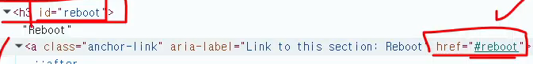
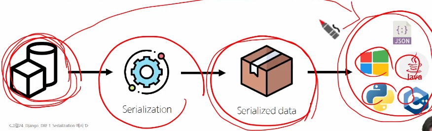
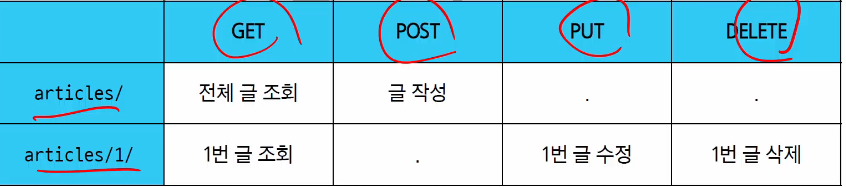
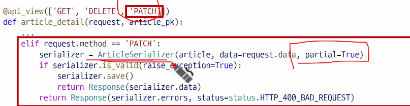

# Rest API
- 배달앱에서 음식을 주문할때, 가게에 직접 전화하지 않아도 된다!

# API
- 두 소프트웨어가 서로 통신할 수 있게 하는 메커니즘
- 날씨 데이터 받기
  - 다양한서비스(폰,컴) <-> 기상청서버
  - 날씨 데이터를 얻으려면?
    - 날씨정보를 얻고싶으면 이런 식으로 요청해야 한다는 지정된 형식들이 작성되어있음.
    - 지역 날짜 조회할 내용들을 제공하는 메뉴얼
    - "이렇게 요청을 보내면 이렇게 정보를 제공해줄 것이다"라는 메뉴얼이 API
## Web API
-  Third Party API : 직접 개발하지 않은 외부의 서비스
## REST API
- API Server를 개발하기 위한 일종의 소프트웨어 설계 방법론
- 집을 지을때 기초-골조-내장-마감처럼 정해진 순서
- API마다 제각각인 구조를 정리하고 누구나 예측가능한 구조로 가겠다.
- RESTful API
  - "자원(=데이터)을 정의"하고 "자원에 대한 주소를 지정"하는 전반적인 방법을 서술
- REST API 실제 활용 예시
  - Ncloud API 문서를 보면, RESTful API방식으로 제공된다고 적혀있음.
  - (뜻: 너가 어느정도 예상한 구조가 맞을거야 라고 명시한 것임)
- 시스템 간 표준화된 통신 구조를 제공함으로써 서로 다른 기술 스택 간에도 연동이 가능
- REST에서 자원을 정의하고 주소를 지정하는 방법
  - 자원의 "식별"
    - URI
  - 자원의 "행위"
    - GET, POST 등의 HTTP Methods
  - 자원의 "표현"
    - JSON 데이터 (데이터타입을 뭘로할 것이냐)
## 자원의 식별
- URI (Uniform Resource Identifier) (통합 자원 식별자)
- 우리는 원레 URL을 사용중 URI가 더 큰개념.
- 가장 일반적인 URI는 웹 주소로 알려진 URL
- URL: Uniform Rsource Locator (통합 자원 위치): 서버의 어디에 리소스가 있는가?: 주소
  - http://  : Schema(or Protocol): URL의 첫부분은 브라우저가 어떤 규약을 사요하는지 나타냄
    - 기본적으로 웹은 https를 요구
  - www.example.com
    - 도메인 google.com의 IP주소는 142.251.42.142 임.
    - 사람이 외우기 ㅓ렵기 때문에 직접 IP주소를 사용하지않고, Domain Name으로 사용
  - :80
    - 웹 서버의 리소스에 접근하는 사용되는 기술적인 문(Gate)
      - HTTP - 80 , HTPPS - 443
      - django에서 8000은 80뒤에 00번이라는 뜻
  - /path/to/myfile.html
    - 초기에는 실제 파일이 위치한 물리적 위치를 나타냈지만, 오늘날은
    - 실제 위치가 아닌 추상화된 형태의 구조를 표현
  - ?key1=value1&key2=value2
    - & 기호로 구분되는 key-value쌍 목록
    - 서버는 응답하기 전에 이러한 파라미터를 사용하여 추가 작업을 수행할 수 있음
  - #SomewhereInTheDocument
    - Anchor
    - 일종의 '북마크', 서버가 아닌 브라우저가 응답함. 같은 페이지에서 특정위치?
    - 
## 자원의 행위
- methods 정의
  - HTTP Request Methods
  - 리소스에 대한 행위. 수행하고자 하는 동작을 정의
- HTTP Request Methods 종류 (요청)
  - GET
    - 서버에 리소스의 표현을 요청
    - GET을 사용하는 요청은 데이터만 검색해야 함
  - POST
    - 데이터를 지정한 리소스에 제출
    - 서버의 상태를 변경
  - PUT
    - 요청한 주소의 리소스를 수정
  - DELETE
    - 삭제
- status code (응답)
  - HTTP response status codes
    - 특정 HTTP 요청이 성공적으로 완료 되었는지 여부를 나타냄
    - Infomational responses (100-199)
      - 요청을 계속 진행 중이라는 중간 응답
    - Successful responses (200-299)
      - 요청이 정상적으로 처리되었음을 의미
    - Redirection messages (300-399)
      - 요청한 리소스가 다른 위치로 옮겨갔을 때 사용
    - Client error responses (400-499)
      - 클라이언트 요청에 문제가 있을 때 반환
    - Server error responses (500-599)
      - 서버 내부의 문제로 요청을 처리하지 못했을 때 사용
## 자원의 표현
- 그동안 서버가 응답했던 것
  - 지금까지 장고서번느 사용자에게 페이지(html)만 응답하고 있었음
  - 하지만 서버가 응답할 수 있는건 페이지 뿐만 아니라 다양한 데이터타입을 응답가능
  - REST API는 이 중에서도 JSON 타입으로 응답하는 것을 권장
    - JSON은 데이터만을 전달하기 위한 최소한의 형식(키-벨류)
- 응답 데이터 타입의 변호
  - 페이지(html)만을 응답하는 서버
  - 이제는 JSON 데이터를 응답하는 REST API 서버로의 변환
    - 서버는 HTML 페이지를 만들지 않고, JSON 데이터만 응답하는 방식으로 동작가능
    - HTML 대신 JSON만 전달하므로, 응답 용량이 줄고 처리 속도가 빨라짐
  - django는 더 이상 화면(Template)을 그리는 역할을 하지 않음
    - 대신, 오직 데이터(JOSN)만을 응답하는 API 서버로 역할이 변화
    - 이제 Vue 같은 Front-end 프레임 워크가 전담하며, 프론트/백앤드 구조로의 전환을 의미
  - 이제부터 django를 사용해 RESTful API 서버를 구축할 것
## DRF 정의
- Django REST framework
- django에서 RESTful API 서버를 쉽게 구축할 수 있도록 도와주는 오픈소스 라이브러리
- settings.py에 등록해야함
## Postman 화면구성
1. 요청 URL 작성
2. 요청시 필요한 데이터 작성
3. 응답 결과 출력 화면

## Serializer (직렬화)
- 여러 시스템에서 활용하기 위해 데이터 구조나 객체 상태를 재구성할 수 있는 포맷으로 변환하는 과정
- 서버에서 폰,컴 등 여러 시스템에서 활용가능하도록 하는것
- 변환된 데이터는 다른 프로그램,다른언어,다른컴퓨터에서도 다시 원래의 구조로 본원가능
- 즉, 직렬화는 데이터를 '어디서든 읽고 사용할 수 있게 만드는 공통 언어로의 번역'이다.
- 
- 우선 우리는 JSON
## Serializer
- Serializer Class 여러클래슬르 serializers.py 파일을 생성하여 작성
- ModelSerializer: 알아서 직렬화된 데이터를 모델에 맞춰.. 뭐시기 자동으로해줌.
- CRUD with ModelSerializer
  - 
  - articles/ 라는 주소로 GET으로 보내느냐 POST로 보내느냐에 따라 다른 액션
  - articles/1/ 라는 주소로 GET, PUT, DELETE 로 보내느냐에 따라 다른 액션
  - 주소에 동사가 들어가지 않도록, 자원 중심으로 설계하기.
- GET 메서드(조회)
  - articles/ : 전체글조회
  - articles/1/ : 1번글 조회
  - GET - List(1/3)
## ModelSerializer의 인자 및 속성
- many 옵션: seerialize 대상이 쿼리셋인 경우 입력
- .data 실제 데이터를 추출
# POST method - 생성
- POST
  - 게시글 데이터 생성하기
  - 1. 데이터 생성이 성공했을 경우 201 created 응답
  - 2. 데이터 생성이 실패했을 경우 400 Bad request 응답
# 수정
- 부분수정은 스크린샷
- 
