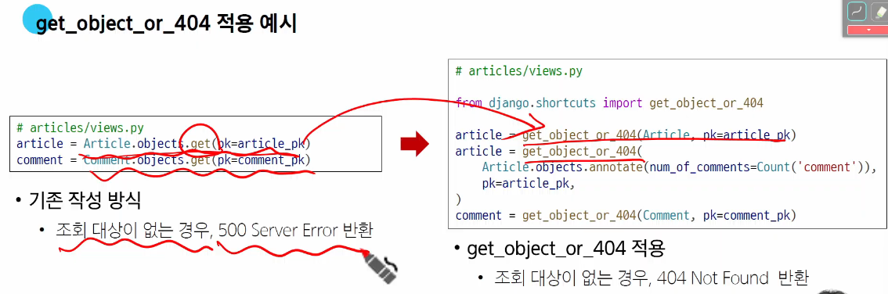
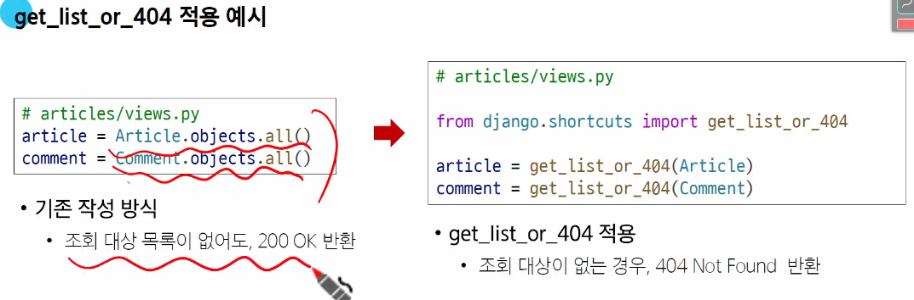

# 배달앱에서 여러 사용자가 여러 음식점을 즐겨찾기 등록
- 사용자 A는 치킨,피자집
- 사용자 B는 분식,피자집
# URL 및 HTTP request method 구성
- articlse/1/comments/ : POST요청: 댓글생성
# POST method

# 읽기 전용 필드
- 서버가 조회 요청에 대한 응답 시에만 값을 표시하는 필드
- 읽기전용필드 사용목적
  - 클라이언트 측에서 직접 수정하면 안되는 경우
  - 서버 로직에 의해 자동 생성,관리되는 값 활용
  - 입력은 받지 않지만 정보를 제공해야 하는 경우
  - 새로운 필드값을 만들어 제공해야 하는 경우

# DELETE & PUT method

# 응답 데이터 재구성
- 댓글 조회 시 게시글 출력 내역 변경
  - 댓글 목록 조회 시 게시글 번호만 제공해주는게 아닌 '게시글의 제목'까지 제공하기
  - title필드만 따로 반환하는 Serializer를 별도로 정의해야함

# 읽기 전용 필드 주의사항
- read_only_fields
  - 기존의 외래 키 필드 값을 그대로 응답 데이터에 제공
- read_only
  - 새로운 응답 데이터

# 역참조 데이터 구성
- 단일 게시글 조회시 댓글목록
- 단일 게시글 조회시 댓글개수

## 단일게시글 + 댓글목록

## 단일게시글 + 댓글개수
- 모델을 바꾸는게 아니라 조회결과에 새로운 데이터를 추가하는 것

# drf-spectacular
- 우리의 주소,요청방식을 정리해주는 페이지

# 올바르게 404 응답하기
- 
- 