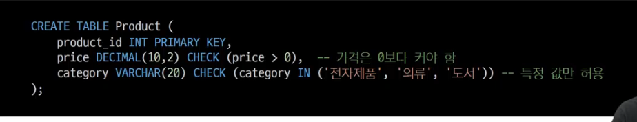
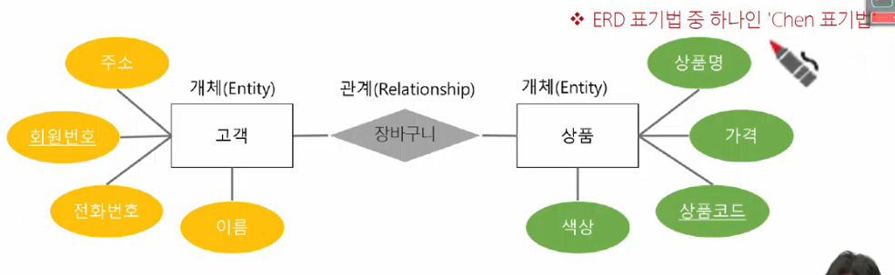
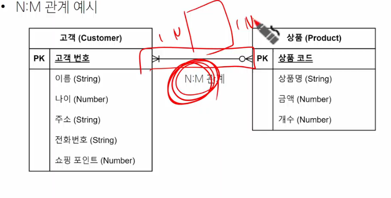
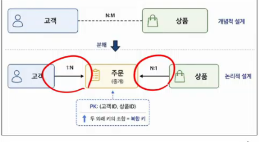
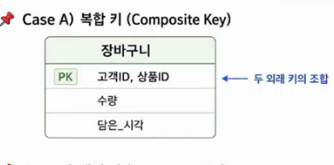
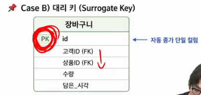
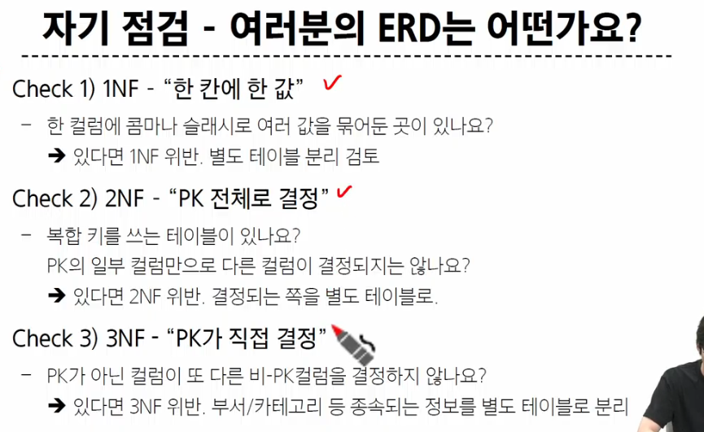

## 참조 무결성
- ON_DELETE = CASCADE

## 도메인 무결성
- 
- 고유성
  - 이메일 주소는 한사용자당 하나 unique = True
## 모델링 과정 4단계
- 데이터베이스 모델링 진행
  - 1. 요구사항 수집 및 분석
    - 어떤 종류의 데이터를 정리할 것인가.
      - 개체: 업무에 필요하고 유용한 정보를 저장하는 집합적인 것
        - 고객, 상품
      - 속성: 관리하고자 하는 것의 의미를 더이상 작은 단위로 분리되지 않은 데이터 단위
        - 고객명,고객전화번호,상품명,상품가격
      - 관계: 객체 사이의 논리적인 연관성을 의미하는 것
        - N:1 같은

  - 2. 개념적 설계
    - 이 단계의 산출물이 ERD(ER Diagram)
      - DB종류나 구현기술과 무관하게, '도메인의 구조'만 그림.
      -     : Chen 표기법 (교과서,학술자료)
      -     : 까마귀 발 (실무)
  - 3. 논리적 설계
    - 테이블,컬럼,제약조건 등 구체적 DB 개체를 정의
    - 정규화를 수행하여 중복을 최소화하고 일관성을 유지
    - 개념적 설계에서의 N:M은 중개테이블 넣기
      - 
      - 복합키
        - 
      - 대리키 (실무)
        - 

  - 4. 물리적 설계
    - 보안, 백업 및 복구, 성능 최적화 등을 고려하여 데이터베이스 설정

## 데이터베이스 정규화
- 정규화
  - 데이터 중복을 최소화하고, 이상 현상을 예방하여 구조화하는 과정
- 정규화 목적
  - 1. 중복 최소화: 불필요한 중복 데이터 제거해 일관성 유지
  - 2. 이상현상방지: 삽입,갱신,삭제 작업 시 발생할 수 있는 불일치 문제 예방
  - 3. 유연성향상: 데이터베이스 구조변경 시 영향을 받는 영역을 최소화하여 유지보수성높임
- 이상 현상 (Anomaly)
  - 1. 삽입 이상
    - 새로운 데이터 삽입 시 불필요한 데이터도 함께 삽입해야 하는 문제
  - 2. 갱신 이상
    - 중복된 데이터 중 일부만 변경되어, 데이터 불일치가 발생하는 문제
  - 3. 삭제 이상
    - 어떤 데이터 삭제시, 다른정보도 같이 삭제되는 문제
- 삽입 이상
  - 부분 정보만 삽입할때, 불필요한 정보까지 억지로 입력해야 하는 상황
- 갱신 이상
  - 올리브,올리브유,올리브오일 이런걸 올리브로 통일하고 싶다.
- 삭제 이상
  - 명란파스타라는 행을 지우면, 그 안의 재료인 명란젓 이라는 정보도 같이 지워짐.
- 문제 원인
  - 하나의 테이블에 다 때려넣어 이런 상황 발생
- 해결 방법
  - 정규화
    - 1. 재료를 별도 테이블로 분리
    - 2. N:M 구조를 설정
    - 한 칸에 한값 : 제1정규형
    - 정규화의 단계는 어떤 약속을 추가하는가.(제1정규형의 약속은 한칸에 한값)

- 정규화 종류
  - 2NF, 3NF까지 진행
  - 제1 정규형 (1NF)
    - 한 컬럼은 하나의 값만 가져야함
  - 제2 정규형
    - 제1정규형을 만족하면서, PK가 아닌 모든 속성이 PK에 완전함수종속 되어야 한다.
  - 제3 정규형
    - 1,2 만족하면서, 모든 속성이 PK에 이행적함수종속 이 되지 않아야 한다.
  - BCNF
    - 앞에꺼 만족하면서, 모든 결정자가 후보키 여야 한다.

- 1NF
  - 제1정규형 시도: 컬럼을 추가한다. => NULL값 발생
  - 두번째 시도: 행을 추가한다. => 중복발생
  - * 전화번호 테이블을 새로 생성 하여 고객을 참조
- 2NF
  - 복합 키를 사용하는 테이블에서, 모든 비 기본키 속성이 기본키의 모든 컬럼에 완전종속 되어야 한다.
  - 예시:
    - (학생,과목) 를 하나의 pk로 보면, 데이터의 유일성이 보장
  - 함수 종속성이란?
    - 주민번호를알면 이름을 알수 있는. 알면 자동으로 따라오는 것.
    - A를 알면 B가 하나로 정해질때. 
      - A -> B 로 표기.
    - 완전 함수 종속
      - 복합키가 하나의 컬럼을 결정함.
      - 부분함수종속은 복합키의 일부가 하나의 컬럼을 결정하는 상황.
        - 2NF는 이것을 금지
      - 그 문제되는 일부정보를 테이블로 따로 빼고
      - 기존 복합키의 문제 안되는부분 테이블에서 그 문제테이블을 외래키로 참조하여
      - 완전함수종속으로 씀.
- 3NF
  - 기본 키에 대한 이행적 함수 종속이 없어야 함.
    - A->B를 결정, B->C를 결정인 경우 A->C가 됨. 이게 이행적 함수종속.
    - 이것도 테이블분리하여 외래키로 연결.

## 정규화 요약
1. 한칸에 한값
2. PK 전체로 결정
3. PK가 직접 결정
4. 제3정규형이 못잡는 케이스. 조금 더 엄격한 케이스.

- BCNF
  - 모든 결정자가 후보키 여야함.
  - 후보키
    - PK가 될 수 있는 후보
    - 1. 유일성: 테이블의 각 행을 고유하게 식별할 수 있어야 함.
    - 2. 최소성: 최소한의 속성 조합 이여야 함.
    - 한 테이블에 여러 후보키가 있을 수 있으며, 그중 하나를 PK로 선택해야함.
    - 학생번호,주민번호 가능 / 전화번호(전화번호변경가능),이름(동명이인) 불가능.
  - "비-PK 단일한 컬럼이 다른 컬럼을 결정하는 상황"
    - 우편번호 --> 시/구
    - 차량번호 --> 차종
    - 서적번호 --> 출판사
    - 3NF에서는 이 상황을 문제삼지 않는다.
  - 후보키 찾기
    - {학생번호,과목명} -> 학점,담당교수 결정 가능
    - {학생번호,담당교수} -> 후보키 ok
    - 담당교수 -> 과목명 x

## 정규화의 대가
- 쪼개진 테이블을 합쳐서 보려면 JOIN이 필요함.
- 메모리 비용 증가

## 의사 결정 순서
1. 일단 3NF/BCNF 까지 정규화한다
2. 성능문제발생? -> ORM옵션으로해결
3. 그래도 부족하면 의도적 반정규화

## 여러분의 ERD는 어떤가요
