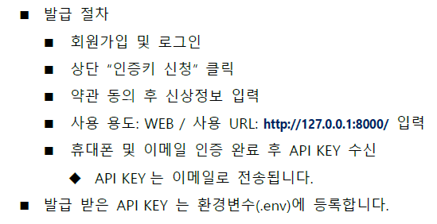
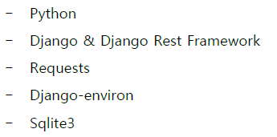

1. 목표
- REST API Server 구축
- 외부 금융상품통합비교공시 API 활용하여 데이터 수집 및 저장 하기
- Serializer를 활용 -> JSON 형태의 응답 반환하기
- Postman 활용해 요청 및 응답

2. 준비사항
- 금융상품통합비교공시 API 의 정기예금 API

- 금융감독원 API KEY 발급
  - 

- 개발 도구
  - 

3. 요구사항
- 정기예금 API 활용하여 API서버 구축 하는 것이 목표
- 클라이언트가 요청 시 JSON 형태로 금융상품데이터를 제공하는 백엔드 핵심기능을 완성한다.

## 요구사항
1. 데이터수집(F801)   ->  API활용해 정기예금상품 및 옵션 정보수집하여 DB에 저장하기
2. 데이터조회(F802)   ->  DB에 저장된 전체 정기예금 상품목록을 JSON 형태로 반환한다.
3. 데이터입력(F803)   ->  POST요청을 통해 새로운 금융상품 데이터를 DB에 추가한다.
4. 데이터조회(F804)   ->  상품코드를 기준으로 해당상품의 옵션정보를 조회하여 반환한다.
5. 데이터분석(F805)   ->  최고금리 상품조회.
7. 환경설정(NF801) ->  금융감독원 API Key를 발급받고 .env 파일로 환경변수를 관리한다.
8. 보안성(NF802)   ->  .gitignore에 .env
9. 개발효율성(NF803)
10. 문서화(NF804)  ->  README
11. 테스트(NF805)  ->  Postman 활용해 검증
-------심화--------
1. 생성형AI(F811) ->  생성형 AI 활용하여 실제 은행상품 형태의 더미 데이터를 생성하고 JSON 형태로 제출
2. 
